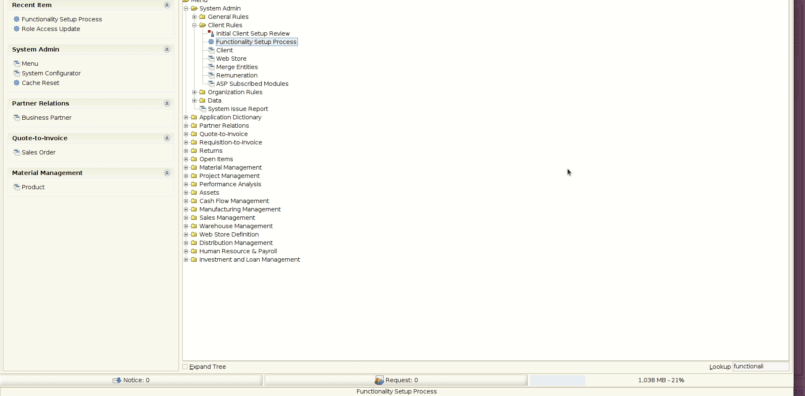
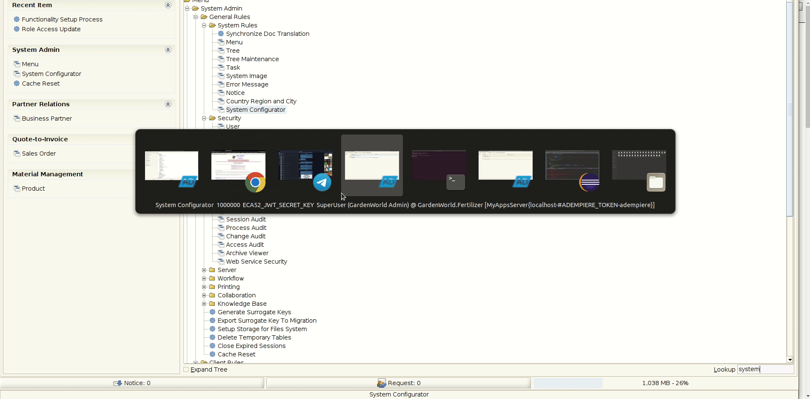
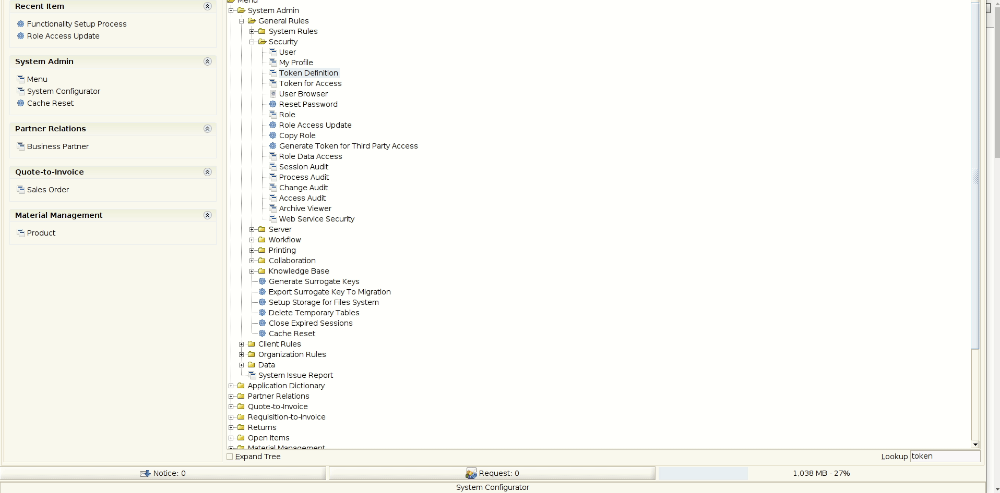

# ADempiere JWT Token

A token generator using [JWT](https://jwt.io/) structure, this project is fine to generate third part access using JWT structure.

Use this project if you need connect to ADempiere using [ADempiere Middleware](https://github.com/adempiere/adempiere-middleware)

## Requirements
- [JDK 11 or later](https://adoptium.net/)
- [Gradle 8.0.1 or later](https://gradle.org/install/)


### Packages Names
you should change the follows packages for your own implementation, just change the word `template` by your implementation

```Java
org.spin.eca52.model.validator
org.spin.eca52.setup
org.spin.eca52.util
```

### Security Token Generator
The main class for generate and validate token is here: `org.spin.eca52.security.JWT`

### Deploy Class
For deploy project just run the setup `org.spin.eca52.setup.CreateTokenDefinition`, this create a new token definition by client.

### Static util class for any constant
The util class for constat and other value is `org.spin.eca52.util.JWTUtil`

## Binary Project

You can get all binaries from github [here](https://central.sonatype.com/artifact/io.github.adempiere/adempiere-jwt-token/1.0.0).

All contruction is from github actions


## Some XML's:

All dictionary changes are writing from XML and all XML's hare `xml/migration`


## How to add this library?

Is very easy.

- Gradle

```Java
implementation 'io.github.adempiere:adempiere-jwt-token:1.0.0'
```

- SBT

```
libraryDependencies += "io.github.adempiere" % "adempiere-jwt-token" % "1.0.0"
```

- Apache Maven

```
<dependency>
    <groupId>io.github.adempiere</groupId>
    <artifactId>adempiere-jwt-token</artifactId>
    <version>1.0.0</version>
</dependency>
```

## Step by step

### Create Token Definition

Just Run the **Functionality Setup Process** and it add a new Token Definition, also is added a secret key (fill it).



### Set Secret Key

Go to System configurator window and find `ECA52_JWT_SECRET_KEY`, after it just set the secret key. A example can be getting from [here](https://www.grc.com/passwords.htm)



### Generate Token

Now you can generate a new token for third party access from process **System Admin** -> **General Rules** -> **Security** -> **Generate Token for Third Party Access**.


